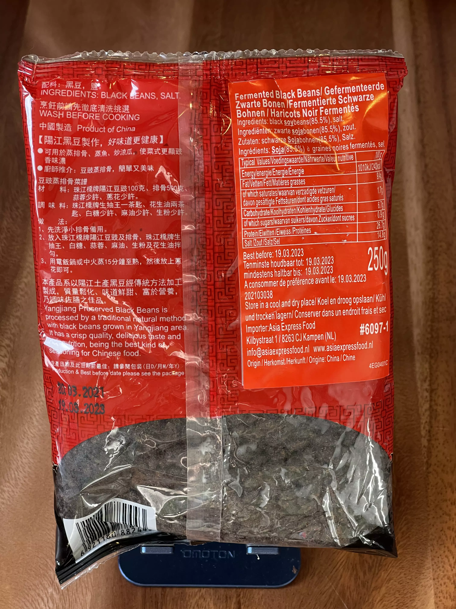

# Fermented black beans

## Alternate names

* 🇺🇸 _tbd_
* 🇩🇪 Fermentierte schwarze Bohnen

## Online findings of this paste

* 🇺🇸 [Sichuan fermented black beans](https://themalamarket.com/products/fermented-black-beans-douchi)
* 🇩🇪 [Fermentierte schwarze Bohnen](https://www.insiderasia.de/fermentierte-schwarze-bohnen.html)

## Store findings

* 🇩🇪 BETA Asia-Supermarkt, Stuttgart ([Google Maps](https://goo.gl/maps/UwoeLhQNrwrqREye6), [Website](http://www.beta-asia-supermarkt.de/))

<figure role="group">
  <figcaption>Pearl River Bridge Yang Jiang Preserved Black Beans</figcaption>
    
  <figure>
    
    <footer><small>CC BY-SA 3.0 Adrian Föder</small></footer>
    <figcaption>Front site of Black Beans</figcaption>
  </figure>

  <figure>
    
    <footer><small>CC BY-SA 3.0 Adrian Föder</small></footer>
    <figcaption>Rear site of Black Beans</figcaption>
  </figure>
</figure>
