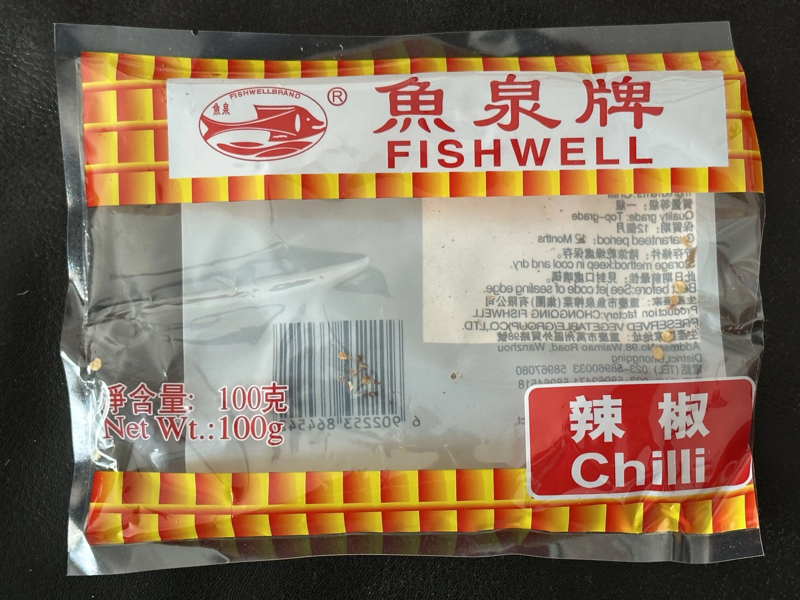

# Fishwell Dried Chilli Peppers

This has a place of production »Wanzhou District, Chongqing, China«. This is kinda close to Sichuan so maybe that's the closest we'll get to Sichuan pepper.

## Store findings

* 🇩🇪 BETA Asia-Supermarkt, Stuttgart ([Google Maps](https://goo.gl/maps/UwoeLhQNrwrqREye6), [Website](http://www.beta-asia-supermarkt.de/))

<figure role="group">
  <figcaption>Fishwell brand dried chilli peppers</figcaption>
  
  <figure>
    
    <footer><small>CC BY-SA 3.0 Adrian Föder</small></footer>
    <figcaption>Front of packaging</figcaption>
  </figure>

  <figure>
    
    <footer><small>CC BY-SA 3.0 Adrian Föder</small></footer>
    <figcaption>Front of packaging</figcaption>
  </figure>

</figure>
