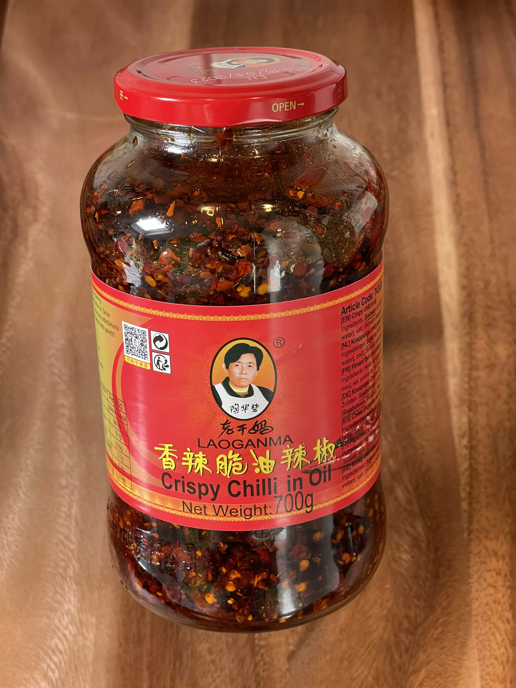
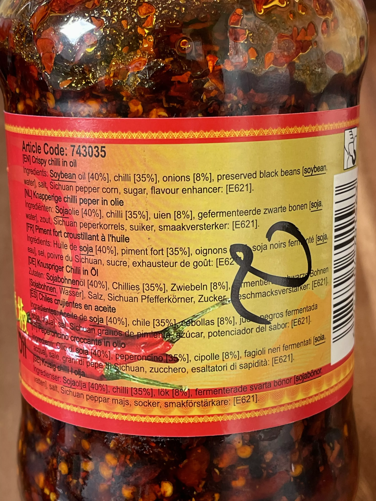
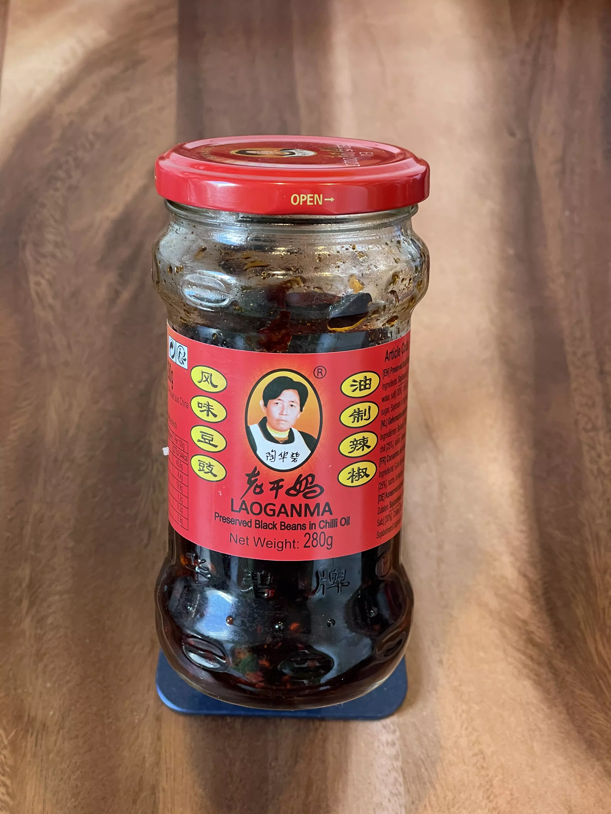
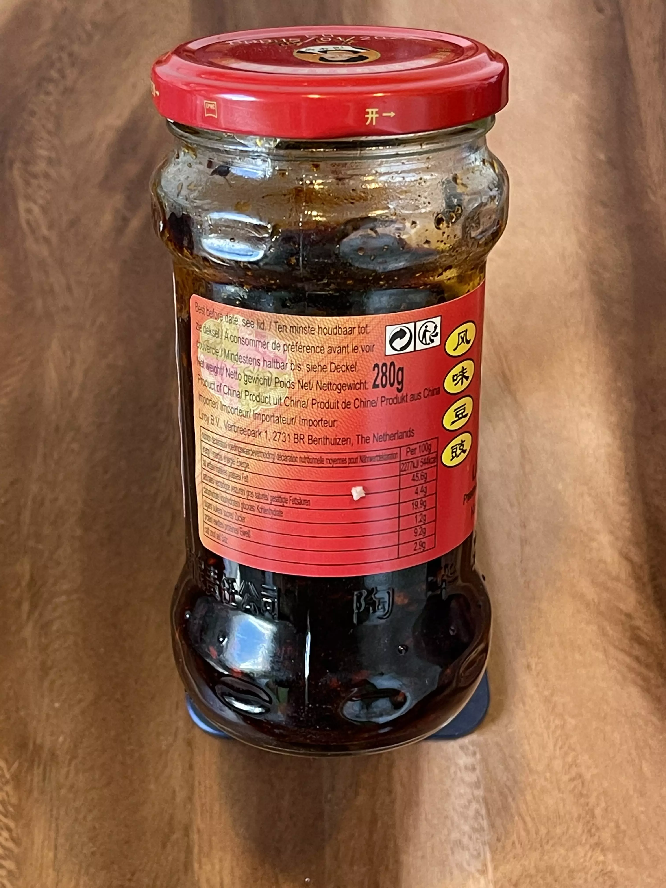

# Lao Gan Ma chili oils

<primary-label ref="ingr"/>
<secondary-label ref="cn"/>

This comes in multiple variations, there’s already a great [YouTube video of it by Chinese Cooking Demystified](https://www.youtube.com/watch?v=MVh7Fu0_Y1o).

## Crispy chili in oil

* 
* 

{columns=2}

### Store findings {id="store-findings-1"}

- 

## Black beans in chili oil

* 
* 

{columns=2}

### Store findings {id="store-findings-2"}

- 
