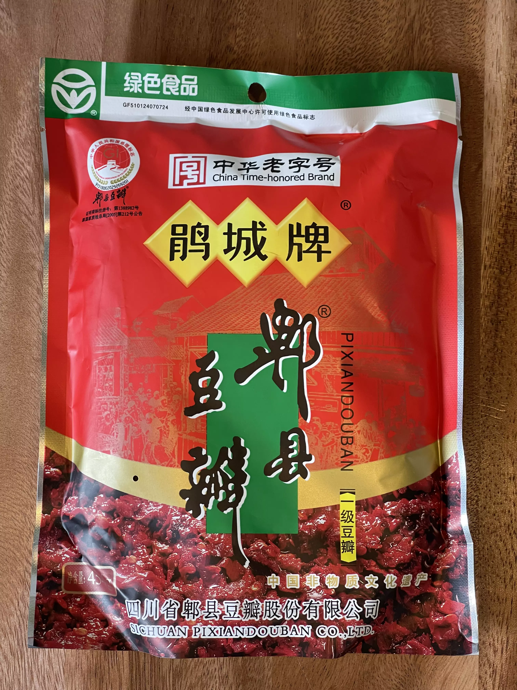
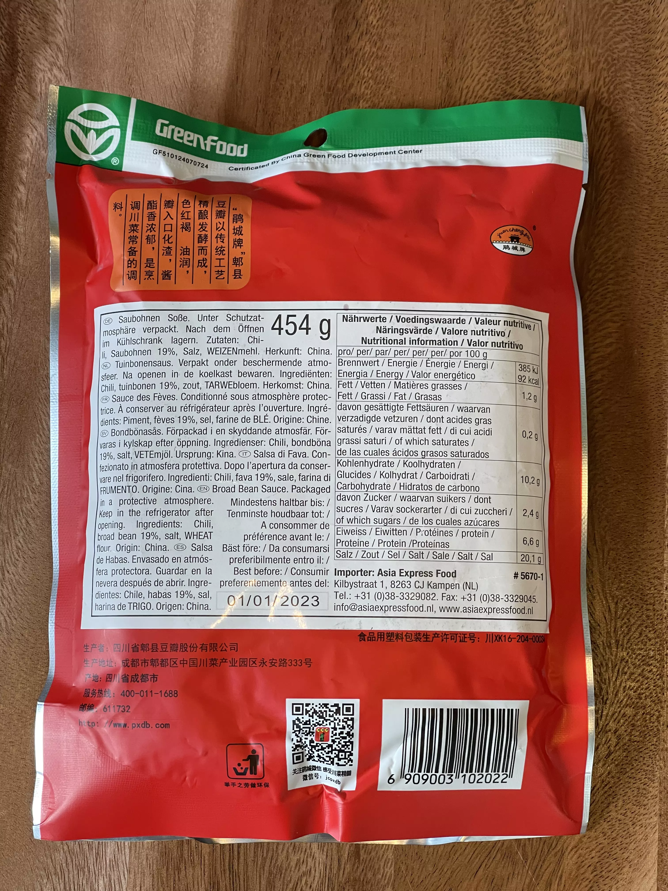

# Broad bean paste

<primary-label ref="pantry"/>
<secondary-label ref="cn"/>

My first contact with this was when my attention got drawn to the [Mapo Tofu](../recipes/mapo-tofu.md). On Kenji López-Alt’s [Serious Eats recipe](https://www.seriouseats.com/real-deal-mapo-dofu-tofu-chinese-sichuan-recipe) and a [comment](https://www.seriouseats.com/real-deal-mapo-dofu-tofu-chinese-sichuan-recipe#comment-5523380302) by [author `xiaozi`](https://disqus.com/by/xiaozi/) both Kenji and `xiaozi` say[^1] the proper paste to use is _Pixiandouban_.

* 
* 

{columns=2}

## Alternate names

* 🇺🇸 Chili bean paste
* 🇺🇸 Chili bean / broad bean _sauce_
* 🇩🇪 Saubohne / Paste / Sauce

## Online findings of this paste

* 🇺🇸 [Pixian red-oil broad bean paste](https://themalamarket.com/collections/all/products/red-oil-pixian-chili-bean-paste-hong-you-doubanjiang) (Hong you douban / doubanjiang)
* 🇩🇪 [Chili-Bohnenpaste, Pixian Doubanjiang](https://www.insiderasia.de/bohnenpaste-mit-chili-pixian-doubanjiang.html)
* 🇩🇪 [500g Super Scharfe Pixian Sichuan Saubohne in Chilliöl](https://www.ebay.de/itm/255117532580)

## Store findings

- 
