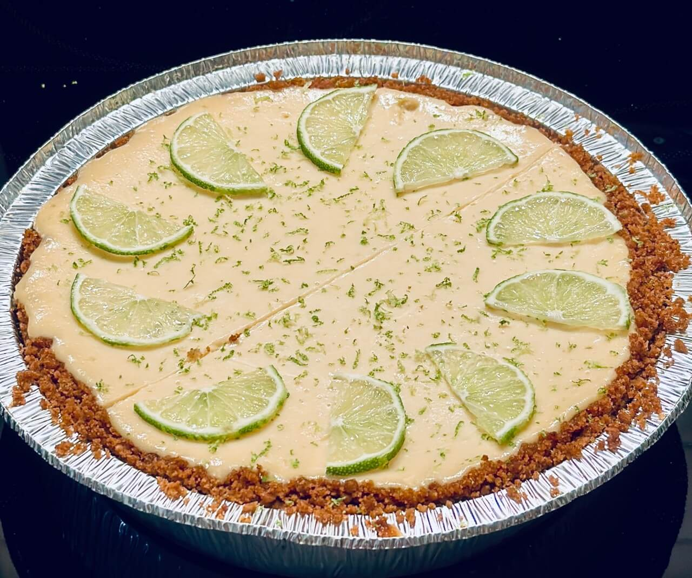

---
tags:
  - Dessert
  - United States
---

# Lime Pie

<figure markdown="span" style="float:right;width:20vw;margin-left:1rem">
  
  <figcaption>Der Lime Pie in einer 20-cm-Aluschale</figcaption>
</figure>

Inspiriert vom „Key Lime Pie“, dem bekannten Kuchen aus den "Keys" Floridas – ein cremiger Limettenkuchen auf einem Keksboden. Da hier keine originalen Key Limes aus den Florida Keys verwendet werden, ist es streng genommen nur ein Lime Pie. Wer dennoch mit Key-Limettensaft backen möchte, kann diesen online bestellen.

Normalerweise wird komplett "gesüßte/gezuckerte Kondensmilch" verwendet, aber ich habe mich für eine Mischung aus gesüßter und "normaler" Kondensmilch entschieden, um die Süße etwas zu reduzieren. Das Ergebnis ist trotzdem sehr lecker und nicht zu süß.

Die Menge ist geeignet für eine Form von 20 bis 25&thinsp;cm Durchmesser, bei 20 wird es schon ein bisschen stuffed, 23-25 sind ideal.

## Zutaten

### Boden:

- 200&thinsp;g Butterkekse (in den USA: Graham Cracker; in Deutschland habe ich Leibniz-Vollkorn-Butterkekse gewählt)
- 100&thinsp;g Butter (flüssig: im Wasserbad verflüssigt)
- 30&thinsp;g Zucker (Vollrohrzucker oder feiner Zucker)
- (Butter zum Einfetten der Form)

### Füllung:

- 1 Dose [gezuckerte Kondensmilch](https://de-en.openfoodfacts.org/facets/categories/de:gezuckerte%20Kondensmilch) (400&thinsp;g) + 1 Pack "normale" Kondensmilch (340&thinsp;g)
- 100&thinsp;g Schmand (notfalls Crème fraîche, hat aber (noch) mehr Fett)
- 2 Eigelb
- 175&thinsp;ml Limettensaft (Direktsaft) (habe den von Hitchcock genommen, da er lt. Etikett in Brasilien abgefüllt wird)
- Geriebene Limettenschale

### Zur Dekoration:

- Limetten (halbe Scheiben)
- mehr gerieben Limettenschale

## Zubereitung

1. Backform gut einfetten
2. Boden vorbereiten:
    - die 200&thinsp;g Kekse fein zerbröseln (habe das mit der KÜchenmaschine gemacht)
    - die 30&thinsp;g Zucker unter die Brösel mischen
    - die 100&thinsp;g flüssige Butter über die Brösel gießen und alles gut vermischen: ich lasse das im Wasserbad, damit die Butter weiter flüssig bleibt und sich besser mit den Bröseln vermischt
    - in die Form geben, gleichmäßig andrücken und einen Rand hochziehen. Mit einem Löffel, Glasboden, oder Burgerpresse geht das gut :)
3. Boden bei 180&thinsp;°C (Ober-/Unterhitze) für 8–10′ vorbacken.
4. Füllung verrühren:
    - 175&thinsp;ml Limettensaft mit der beiden Kaffeesahne, den 100&thinsp;g Schmand und den 2 Eigelb mit einem Schneebesen verrühren, bis eine homogene Masse entsteht
    - gerieben Limettenschale unterrühren
    - auf den vorgebackenen Boden gießen
5. Bei 180&thinsp;°C für 25–30′ backen. Die Füllung sollte nicht ganz fest sein, aber auch nicht mehr flüssig.
6. Komplett auskühlen lassen, idealerweise auf einem Gitter. Danach in den Kühlschrank und richtig durchkühlen lassen.
7. Über die Füllung Limettenschale reiben und die halben Limettenscheiben dekorativ auflegen, sodass evtl. ein Stück Kuchen eine halbe Limettenscheibe als Topping hat.
