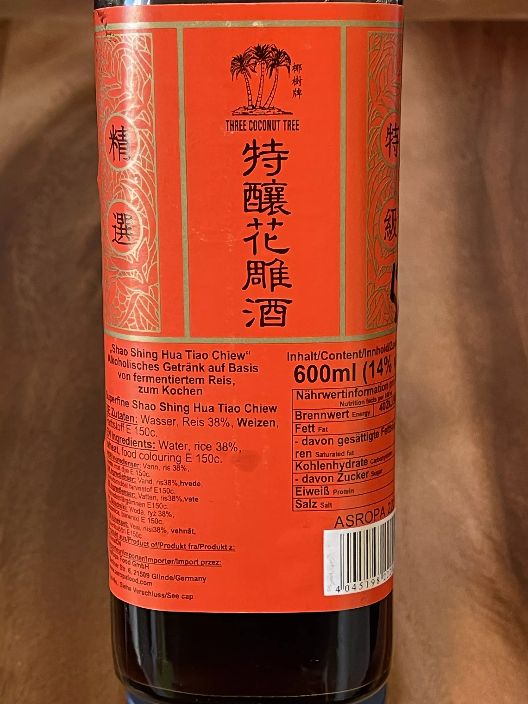

# Xiaoxing wine

### Store findings

* 🇩🇪 BETA Asia-Supermarkt, Stuttgart ([Google Maps](https://goo.gl/maps/UwoeLhQNrwrqREye6), [Website](http://www.beta-asia-supermarkt.de/))

<figure role="group">
  <figcaption>Coconut tree Xiaoxing wine</figcaption>

  <figure>
    
    <footer><small>CC BY-SA 3.0 Adrian Föder</small></footer>
    <figcaption>Whole bottle</figcaption>
  </figure>

  <figure>
    
    <footer><small>CC BY-SA 3.0 Adrian Föder</small></footer>
    <figcaption>Ingredients</figcaption>
  </figure>
</figure>
